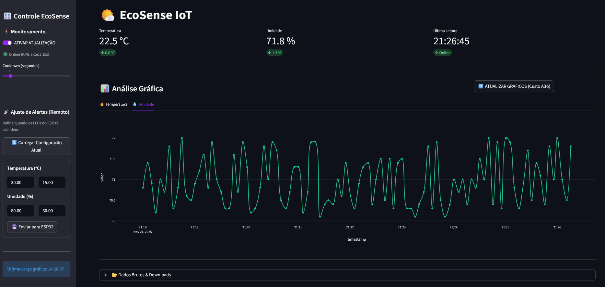
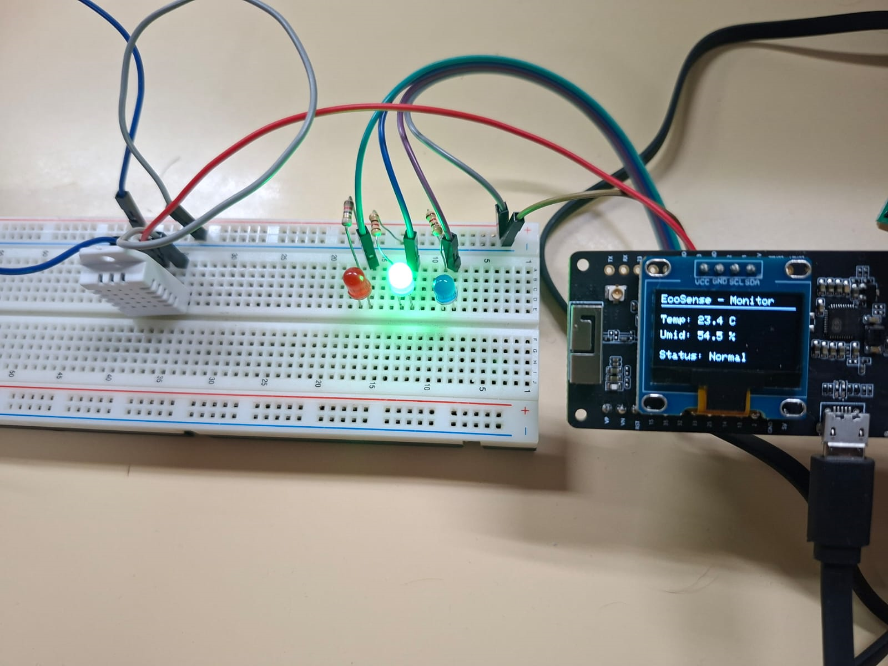

# 🌦️ EcoSense IoT -- Estação Meteorológica Inteligente

[](https://www.python.org/)
[](https://streamlit.io/)
[]()
[](https://opensource.org/licenses/MIT)

Um sistema completo de monitoramento ambiental voltado para eficiência, baixo custo e controle remoto. A solução integra **ESP32 + MQTT + Firebase + Streamlit**, oferecendo coleta contínua de dados climáticos, visualização em tempo real e configuração remota de limites.

<p align="center">
  
</p>

------------------------------------------------------------------------

## 🌐 Visão Geral do Projeto

O **EcoSense IoT** monitora temperatura e umidade usando um sensor DHT22 conectado ao ESP32. Os dados são enviados via **MQTT** para um script **Python Bridge**, que os salva no **Firestore**, permitindo consultá-los no **Dashboard Web**.

O sistema também permite **controle remoto**: o usuário define limites no Dashboard e o ESP32 recebe automaticamente as novas configurações via MQTT.

------------------------------------------------------------------------

## 🏗️ Arquitetura do Sistema

O fluxo do projeto combina comunicação bidirecional utilizando **MQTT + Firebase**.

### **1. Monitoramento (Upload)**

-   ESP32 lê o DHT22 a cada 15 segundos;
-   Publica temperatura e umidade via MQTT;
-   O *Bridge* Python intercepta e grava os dados no Firestore;
-   O Dashboard exibe dados utilizando cache para economia.

### **2. Controle Remoto (Download)**

-   Usuário define limites no Dashboard;
-   Dashboard salva a configuração no Firestore;
-   O Bridge detecta alterações e publica configuração via MQTT;
-   O ESP32 aplica imediatamente as novas regras (LEDs, limites, etc.).

------------------------------------------------------------------------

## 🛡️ Estratégia "Firebase Free Tier" (Economia)

Para manter o projeto dentro do plano gratuito (Spark), foram adotadas otimizações importantes:

-   **Hardware:** envio de dados a cada 15s (reduz \~17k → \~5.7k escritas/dia)
-   **Dashboard:**
    -   KPIs atualizam automaticamente, mas apenas 2 documentos são lidos;
    -   Gráficos históricos só atualizam *sob demanda* para evitar exceder o limite diário;
    -   Botão **"Ativar Atualização"** permite pausar consumo.

------------------------------------------------------------------------

## 🔌 Hardware Utilizado

<p align="center">
  
</p>

### **ESP32 TTGO T-Beam V1.1**

| Componente       | Pino      | Função                    | Comportamento               |
| ---------------- | --------- | ------------------------- | --------------------------- |
| DHT22            | GPIO 02   | Temperatura/Umidade       | Leitura periódica           |
| LED Vermelho     | GPIO 25   | Alerta Temperatura        | Pisca se fora do limite     |
| LED Azul         | GPIO 26   | Alerta Umidade            | Pisca se fora do limite     |
| LED Verde        | GPIO 27   | Status                    | Aceso = OK / Apagado = Erro |
| Botão            | GPIO 38   | Input                     | Alterna telas               |
| Display OLED     | I2C 21/22 | Visualização              | Mostra dados e IP           |

------------------------------------------------------------------------

## 💻 Componentes de Software

### **1. Firmware -- `ESP32_Sensor_WiFi.ino`**

-   C++ para microcontrolador;
-   Bibliotecas: WiFi, PubSubClient (MQTT), ArduinoJson, Adafruit, SSD1306, DHT.
-   Destaques:
    -   Multitarefa usando `millis()` (sem travar Wi-Fi);
    -   Display OLED exibe limites atuais e status.

------------------------------------------------------------------------

### **2. Ponte de Comunicação -- `backend_bridge.py`**

-   Conecta MQTT ↔ Firestore.
-   Funções:
    -   Salvar dados recebidos do ESP32;
    -   Detectar alterações no Firestore e enviar comandos.
-   Usa variáveis de ambiente (.env) para segurança.

------------------------------------------------------------------------

### **3. Dashboard Web -- `main.py`**

-   Construído em Streamlit.
-   Funcionalidades:
    -   KPIs com delta;
    -   Gráficos históricos (manual refresh);
    -   Configuração de limites (Temperatura/Umidade);
    -   Exportação CSV.

------------------------------------------------------------------------

## 🚀 Como Executar

### **Pré-requisitos**

-   Conta Firebase + Firestore criado;
-   Arquivo `firebase_key.json` na raiz;
-   Broker MQTT ativo (ex.: HiveMQ).

------------------------------------------------------------------------

### **1. Criar arquivo `.env`**
```bash
    FIREBASE_CREDENTIALS=firebase_key.json
    MQTT_BROKER=broker.hivemq.com
    MQTT_PORT=1883
    MQTT_TOPIC_TEMP=esp32/streamlit/temperatura
    MQTT_TOPIC_HUM=esp32/streamlit/umidade
    MQTT_TOPIC_CONFIG=esp32/streamlit/config
    COLLECTION_DATA=estacao_dados
    COLLECTION_CONFIG=estacao_config
    DOC_CONFIG_ID=limites_alerta
```
------------------------------------------------------------------------

### **2. Instalar dependências**

    pip install streamlit pandas plotly firebase-admin paho-mqtt python-dotenv streamlit-autorefresh

Ou usando:
```bash
    pip install -r requirements.txt
```
------------------------------------------------------------------------

### **3. Rodar o Backend (Bridge)**
```bash
    python backend_bridge.py
```
------------------------------------------------------------------------

### **4. Rodar o Dashboard**
```bash
    streamlit run main.py
```
------------------------------------------------------------------------

### **5. Subir Firmware no ESP32**

1.  Abrir o `ESP32_Sensor_WiFi.ino` na Arduino IDE;
2.  Instalar dependências;
3.  Inserir `ssid` e `password`;
4.  Fazer upload.

------------------------------------------------------------------------

## 📚 Estrutura de Pastas

    /
    ├── .streamlit/
    │   └── config.toml
    │
    ├── data/
    │   ├── humidity.csv
    │   └── temp.csv
    │
    ├── ESP32_Sensor_WiFi/
    │   └── ESP32_Sensor_WiFi.ino
    │
    ├── utils/
    │   ├── csv_to_firestore.py     // Script para carregar CSVs ao firebase (dados iniciais)
    │   └── generate_mockdata.py    // Script para gerar dados mockados para pular necessidade de arduino para visualização da aplicação
    │
    ├── backend_bridge.py
    ├── main.py
    ├── requirements.txt
    ├── firebase_key.json      // Não versionar
    ├── .env                   // Não versionar
    ├── .gitignore
    └── README.md

------------------------------------------------------------------------
## 👥 Autores

| Nome             | Links 									                                                         | E-Mail                                                                      |
| ---------------- | ------------------------------------------------------------------------------- | --------------------------------------------------------------------------- |
| Henrique Luan F. | [LinkedIn](https://www.linkedin.com/in/henrique-luan-fritz-70412635a/)          | [Henrique.fritz@sou.unijui.edu.br](mailto:Henrique.fritz@sou.unijui.edu.br) |
| Luan Vitor C. D. | [LinkedIn](https://www.linkedin.com/in/luan-vitor-casali-dallabrida-20a60a342/) | [luanvitorcd@gmail.com](mailto:luanvitorcd@gmail.com) 			                 |
| Lucas P. Sckenal | [LinkedIn](https://www.linkedin.com/in/lucassckenal/)        		               | [lucaspsckenal@gmail.com](mailto:lucaspsckenal@gmail.com) 		               |

------------------------------------------------------------------------

## 📄 Licença

Este projeto está sob licença **MIT**.
